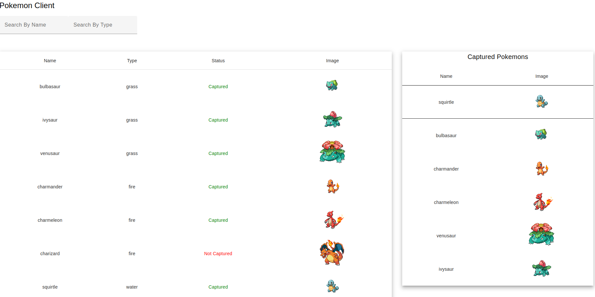

# POKEMON CC

Interview Challenge for ControlCar's Full Stack Software Engineer position.



## Requirements

Ruby version >= 3
Node version >= 18

## Install

Clone this repository and at the root folder run:

```sh
npm run install
```

## Run the app

In the root folder run:

```sh
npm start
```

## REST API

The REST API is described below.

### Import first 150 pokemons from Pokedex API

#### Request

`POST /pokemons/import`

    curl -i -H 'Accept: application/json' -x POST <http://localhost:3000/pokemons/import>

#### Response

    HTTP/1.1 201 OK
    Date: Thu, 24 Feb 2011 12:36:30 GMT
    Status: 201 OK
    Connection: close
    Content-Type: application/json
    Content-Length: 2

    {message: 'ok', status: 'created'}

### Retrieve pokemons (paginated by 10 elements per page and can be filtered by name and type)

#### Request

`GET /pokemons?page=<page>&name=<name>&type<type>`

    curl -i -H 'Accept: application/json' -d 'page=0&name=bulbasaur&type=grass' <http://localhost:3000/pokemons>

#### Response

    HTTP/1.1 200 OK
    Date: Thu, 24 Feb 2024 12:36:30 GMT
    Status: 200 OK
    Connection: close
    Content-Type: application/json

    {
      "results": [
        {
            "id": 1,
            "name": "bulbasaur",
            "type": "grass",
            "captured": true,
            "image": "https://raw.githubusercontent.com/PokeAPI/sprites/master/sprites/pokemon/1.png"
        }...
      ],
      "page": 0,
      "page_count": 4,
      "count": 35
    }


### Retrieve captured pokemons

#### Request

`GET /pokemons/captured`

    curl -i -H 'Accept: application/json' -d <http://localhost:3000/pokemons/captured>

#### Response

    HTTP/1.1 200 OK
    Date: Thu, 24 Feb 2024 12:36:30 GMT
    Status: 200 OK
    Connection: close
    Content-Type: application/json

    {
      "results": [
        {
            "id": 1,
            "name": "bulbasaur",
            "type": "grass",
            "captured": true,
            "image": "https://raw.githubusercontent.com/PokeAPI/sprites/master/sprites/pokemon/1.png"
        }...
      ]
    }

## Capture a Pokemon

### Request

`PATCH /pokemon/:id/capture`

    curl -i -H 'Accept: application/json' -X PATCH http://localhost:7000/pokemon/:id/capture

### Response

    HTTP/1.1 200 OK
    Date: Thu, 24 Feb 2011 12:36:32 GMT
    Status: 200 OK
    Connection: close
    Content-Type: application/json
    Content-Length: 41

    {
      "id": 1,
      "name": "bulbasaur",
      "type": "grass",
      "image": "https://raw.githubusercontent.com/PokeAPI/sprites/master/sprites/pokemon/1.png",
      "captured": true,
      "created_at": "2024-04-10T19:02:24.846Z",
      "updated_at": "2024-04-11T22:15:51.013Z"
    }

## Free a Pokemon (Set status to Not Captured)

### Request

`DELETE /pokemon/:id`

    curl -i -H 'Accept: application/json' -X DELETE http://localhost:7000/pokemon/:id

### Response

    HTTP/1.1 200 OK
    Date: Thu, 24 Feb 2011 12:36:32 GMT
    Status: 200 OK
    Connection: close
    Content-Type: application/json
    Content-Length: 41

    {
      "id": 1,
      "name": "bulbasaur",
      "type": "grass",
      "image": "https://raw.githubusercontent.com/PokeAPI/sprites/master/sprites/pokemon/1.png",
      "captured": true,
      "created_at": "2024-04-10T19:02:24.846Z",
      "updated_at": "2024-04-11T22:15:51.013Z"
    }
